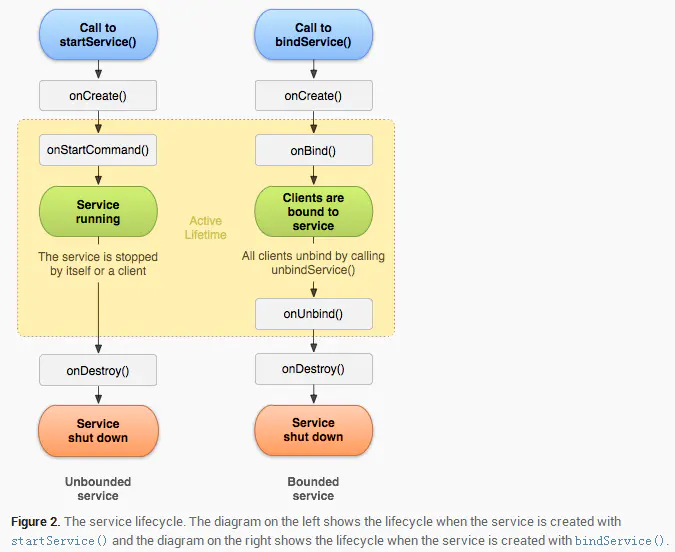

**生命周期**

##### startService 和 bindService 特点
- 启动方式：Context.startService

- 启动方式：Context.bindService 

- 停止方式：Context.stopService 或者 Service.stopSelf

- 停止方式：Context.unbindService

- 多次启动只会多次执行 onStartCommand 方法，只要调用一次 stopService 服务就会销毁

- 多次启动 onBind  一般只执行一次（特殊情况可以多次执行），当所有绑定者都与service 解绑时，service 会自行销毁，其中单独某一个绑定者解绑，service 不会销毁

- 生命周期：onCreate --> onStartCommand --> onDestory

- 生命周期：onCreate --> onBind--> onUnbind--> onDestory

- 服务启动后执行单一的操作并且不会向调用者返回结果，无法通信

- 服务启动后允许组件与服务进行交互、发送请求、获取结果，甚至是利用进程间通信 (IPC) 跨进程执行这些操作

- 调用者退出后，Service 仍然存在

- 调用者退出后，Service（只有一个绑定者时） 随着调用者销毁

- 启动一次服务，多次调用 stopService 只有第一次有效，不会抛出异常

- 启动一次服务，多次调用 unbindService 会抛出异常（IllegalArgumentException：Service not registered）
注意：
>不论哪种方式启动服务，onCreate 只会执行一次，只有当服务销毁（onDestory）后再次启动服务时，又会重新调用 onCreate

>Service与Activity一样都存在于当前进程的主线程，所以，一些阻塞UI的操作，比如耗时操作不能放在service里进行

>bindService 启动服务，绑定者在销毁（onDestory）前需要先解绑，
否则出 *** has leaked ServiceConnection 等错误日志，
意思就是服务连接泄露（因为在关闭Acitivity的时候没有释放链接），
这个错误就好像我们启动了一个对话框，此时我们没有关闭对话框，
如果直接关闭了启动对话框的Activity，也会出现类似的错误，
这个时候我们只需要在Acitivity销毁时释放链接就可以了

    @Override  
    protected void onDestroy() {     
        super.onDestroy();      
        unbindService(connection);  
    }

>同一个绑定者多次绑定服务，解绑一次（unbindService ）即可完成解绑，解绑后在未重新绑定时再次调用 unbindService 会抛出异常。

>bindService 方式启动服务，如果服务 onBind 方法返回 NULL , ServiceConnection.onServiceConnected 方法不会执行。

**分类**
启动本地服务用的是显式启动； 

    //java代码直接指明启动的service：
    Intent intent = new Intent(this, TestService.class);
    startService(intent);
    
    //AndroidManifest代码不需要特殊配置：
    <service
                android:name="com.example.testservices.TestService"
                android:enabled="true"
                android:exported="true">
            </service>
远程服务的启动要用到隐式启动。

        //component代码需要添加包名和service名：
     Intent intent = new Intent();
                ComponentName componentName = new ComponentName(getPackageName(), "com.example.testservices.TestService");
                intent.setComponent(componentName);
                startService(intent)
                
                
        //对应的manifes代码，需要添加action：
       <service
                  android:name="com.example.testservices.TestService"
                  android:enabled="true"
                  android:exported="true">
       
                  <intent-filter>
                      <action android:name="xixixi.buder" />
                  </intent-filter>
       
              </service>
                
**IntentService 介绍**
>IntentService 是 Service 的一个子类，它可以自己处理异步请求，
>在它内部有一个工作线程来处理耗时请求，可以启动 IntentService 多次，
>每个耗时操作会以队列的方式在 onHandlerIntent 方法中回调处理，
>每次只会执行一个工作线程，全部处理完，IntentService 会自动结束，不需要开发者去结束。

- IntentService 的工作线程不在主线程，每次 IntentService 结束后再 startService 都会开启一个与上次不同的线程去处理请求。

- onHandleIntent 中任务结束后就会执行 onDestory，不需要手动调用 stopService，所以 IntentService 是任务结束就自动销毁。

- 如果第一次启动后，onHandleIntent 没处理完，继续 startService，不会再重新实例化这个 Service 实例，而是将请求放到请求队列里，等待第一个处理完再处理第二个。

**前台运行服务**

    Notification notification = new Notification(R.drawable.icon, getText(R.string.ticker_text),
            System.currentTimeMillis());
    Intent notificationIntent = new Intent(this, ExampleActivity.class);
    PendingIntent pendingIntent = PendingIntent.getActivity(this, 0, notificationIntent, 0);
    notification.setLatestEventInfo(this, getText(R.string.notification_title),
            getText(R.string.notification_message), pendingIntent);
    startForeground(ONGOING_NOTIFICATION_ID, notification);
    //指示是否也删除状态栏通知。 此方法绝对不会停止服务。 但是，如果您在服务正在前台运行时将其停止，则通知也会被删除。
    stopForeground()
